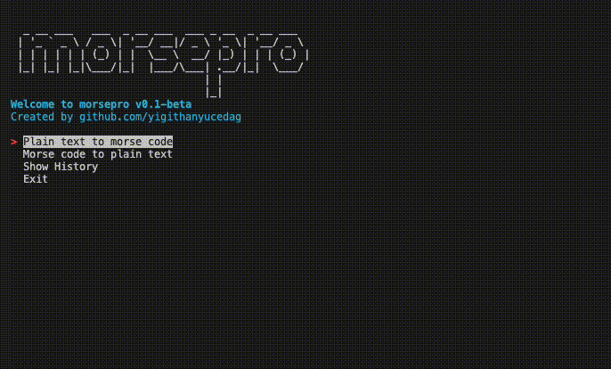

## Morsepro

Python script for encoding and decoding morse code

**Used data structures:**

- Linked List
- Stack
- Hash Table

**Dependencies**

- [simple-term-menu](https://pypi.org/project/simple-term-menu/)
- [pyperclip](https://pypi.org/project/pyperclip/)

Developed and tested on Python 3.10.0.a4 64 bit
